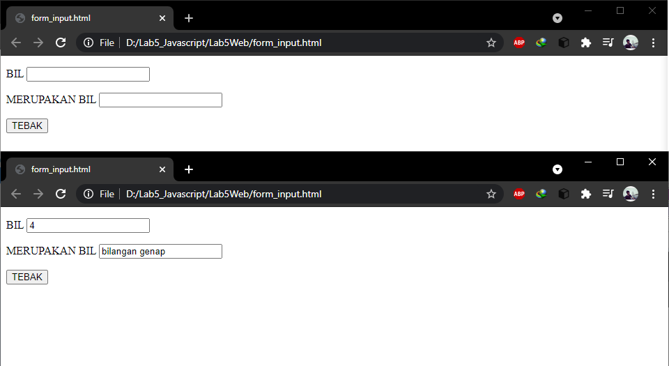
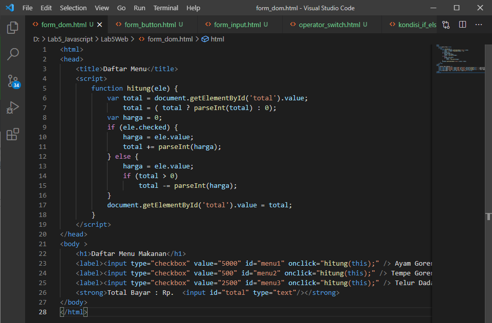

# Lab5Web

### Nama        : Panji Putra Pamungkas
### Nim         : 311910587
### Kelas       : TI. 19. B1
### Mata Kuliah : Pemograman Web - Tugas 5

#### 1. Membuat lab5_javascript.html

Coding pada lab5_javascript.html

Tampilan pada web

#### 2. Pemakaian Alert sebagai properti window.

Coding

Tampilan pada web

#### 3. Pemakaian method dalam objek.

Coding

Tampilan pada web

#### 4. Pemakaian Prompt.

Coding

Tampilan pada web

#### 5. Fungsi dan cara pemanggilannya.

Coding

Tampilan pada web

#### 6. Operasi dasar Aritmatika.

Coding

Tampilan pada web

#### 7. Seleksi kondisi (if dan else).

Coding

Tampilan pada web

#### 8. Operator Switch untuk seleksi kondisi.

Coding

Tampilan pada web

#### 9. Pembuatan form input

Coding

Tampilan pada web

#### 10. Pembuatan form button.

Coding

Tampilan pada web

#### 11. Pembuatan HTML DOM. Pilihan menggunakan checkBox dengan perhitungan otomatis.

Coding

Tampilan pada web

#### Tugas! Buat script untuk melakukan validasi pada isian form.

Coding

Tampilan pada web
